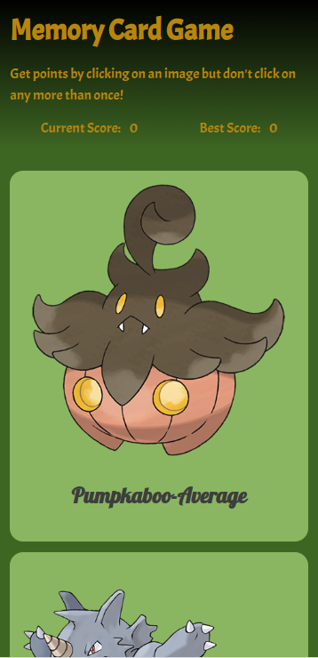
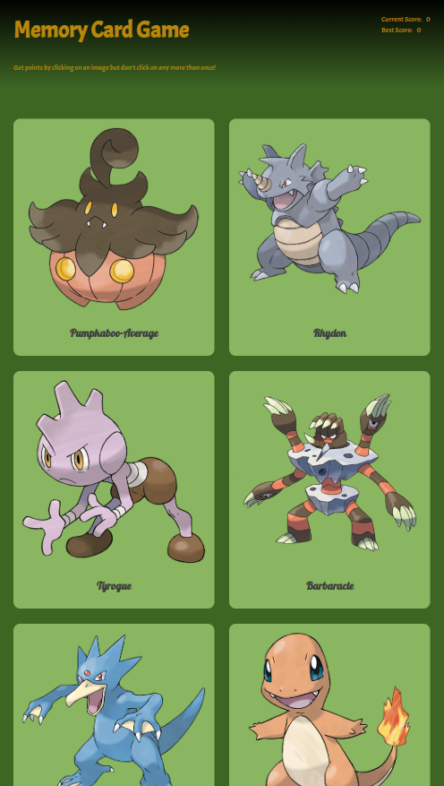
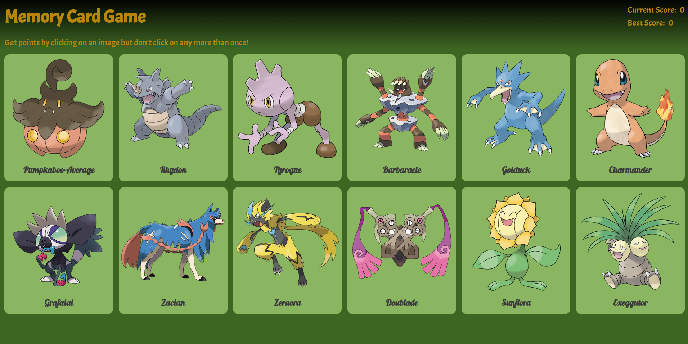

# Memory Card Game

## Introduction

The Memory Card Game is a fun and interactive game that tests your memory skills. The objective is simple:

- Click on a card.
- Avoid clicking the same card twice in a single round.
- Each unique click increases your score.
- The game ends when you click a card you've already clicked.

Your application should include:

- A **scoreboard** displaying the current score and the best score (highest score achieved so far).
- Cards with images and text are fetched from an external API.
- A random shuffling feature for the cards every time the user clicks one or when the game resets.

## Screenshots

- **Mobile View**  
  

- **Tablet View**  
  

- **Desktop View**  
  

## Live Demo

You can view the live project by visiting the following URL:  
[Memory Card Game](https://mem-cards-game.netlify.app/)

## Assignment Requirements

This application and [project](https://www.theodinproject.com/lessons/node-path-react-new-memory-card) is designed to reinforce the concepts of state management using React hooks and interacting with external APIs.

### Features

1. **React Project Setup**

   - Create a new React application.
   - Use React hooks (`useState`, `useEffect`) to manage state.

2. **Game Functionality**

   - Implement a **scoreboard** that updates with the current score and tracks the highest score (Best Score).
   - Add a function to shuffle the cards randomly:
     - Invoke this function on component mount and every time a card is clicked.
   - Fetch images and/or informational text for the cards from an external API. Suggested APIs include:
     - [Giphy API](https://developers.giphy.com/)
     - [PokeAPI](https://pokeapi.co/)

3. **Component Structure**

   - Plan and create components for the application. For example:
     - **Card** component to display individual cards.
     - **Scoreboard** component for the current and best scores.
     - **Game Board** component to handle the layout and logic of the cards.

4. **Styling**

   - Design and style the application to make it visually appealing. Use CSS or a CSS framework of your choice.

5. **Deployment**
   - Push your project to GitHub.
   - Deploy the application using a service like Netlify or Vercel.

---

## License

This project is licensed under the Beerware License. For more details about the terms and conditions of this license, refer to the official documentation: [Beerware License](https://people.freebsd.org/~phk/).

---

## Author

Created by : [Stefan Ljiljak](https://www.linkedin.com/in/stefan-ljiljak/). Feel free to reach out for any suggestions or questions!
